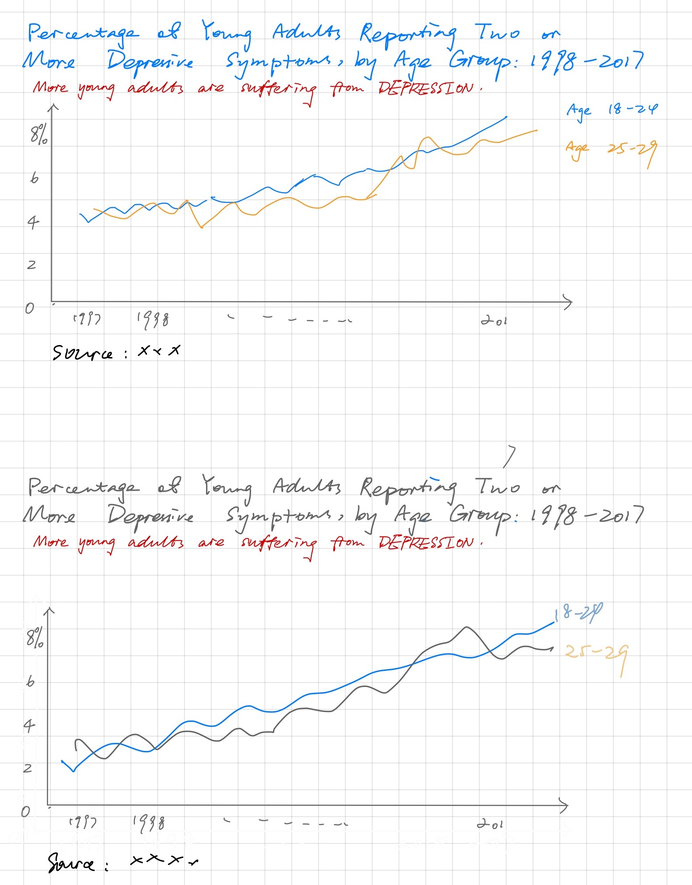

1. Link: <https://www.childtrends.org/indicators/young-adult-depression>
  I selecct this data visualization is because I am interested in the topics of young adults depression. This graph seems easy to capture the idea, but it involves in a lot of confusion about it. I want to give myself a shot to resign a simple graph in a more clear way.
2. My process was

    (1) I looked at the visual graph to take notes about what first came to me from the graph.

      - two dashed lines
      - some random numbers
      - large blank area

    (2) I summarized the idea from the graph: there is no big change of the number of young adults throughout the years. After looking at the graph for a while, the blue dashed line seems to incrase in general.

    (3) I like the simple layout of the graph, which makes it clear and easy for the audience. The color it used shows the difference between two sets of data. However, I do not like the large blank area and the dashed line type. It makes me confused about which line to follow, because the dashes are jumpy, which distract attention. In addtion, it does not use the suitable unit of y-axis, which makes the trends look like flat.
  
    (4) I would definitely change the title to "More young people are suffering from depression" to emphasize the trends. Secondly, I will change the proportion unit of y-axis. As there is no data above 10%, there is no need to include the steps above 10%. I also want to change the line type to solid line.
  
    Here I attached my wireframes.

    (1) I changed the range of the y-axis and add a summary to the graph to emphasize the increasing number of depressed young adults.  
  
    (2) I found the last visulization is too colorful, therefore I changed some colors, including title, line.
  
    (3) I got some feedback:
  
      - They were confused about the two lines: is there any comparsion between them? -> There is no comparsion between them. I make the blue one stand out, because it presents a more clear increasing trend.
      - The y-axis does not have a name. It says the same thing as the title. -> I seperate the name of the y-axis and the tile.
      - The trends of the data is not obvious. -> I changed the title to "trends" to emphasize the focus.

  I tried different types of charts, such as pie chart, bar chart, but they cannot show the trends of the data. All I want is to make the increasing trend stand out.
3. Here is my [data visalization](
https://prod-useast-b.online.tableau.com/t/yigu/views/Depressiontrends/Sheet2?:showAppBanner=false&:display_count=n&:showVizHome=n&:origin=viz_share_link)
