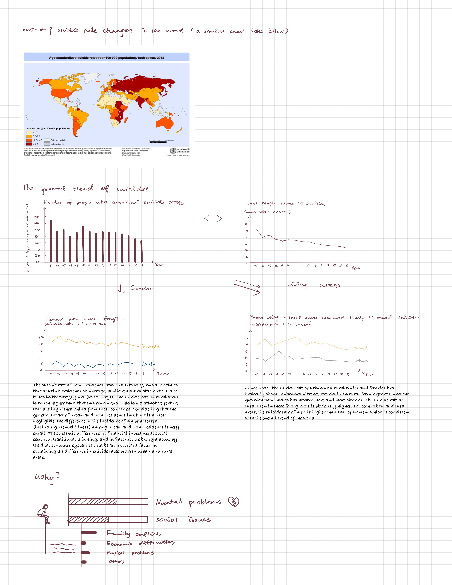

# Outline

## Summary

Suicide is a heavy topic, the number of of which is cold. Care should have temperature, requiring the warmth from the whole society. The reason why I choose the topic "suicides in China" is that I want to find out how depression influence peoples' thoughts about life, why they choose to suicide, and also what the trends will be. It is intended to arouse people's attention to mental health in China.

## Project Structure

- How many people choose to suicide in China from 2005? What's the trend of suicide rate?
- Does gender impact the suicide rates?
- Is where they live related?
- What's the difference of suicides percentage between different age groups?

## Initial Sketches

## Improved Sketches

## The data

The data that I used for the final project are primarily from [WHO Global Health Observatory data repository](https://apps.who.int/gho/data/view.main.MHSUICIDEv?lang=en) and [Chinese Health Database](http://www.epschinadata.com/data-resource.html) on EPS China Data.

I will use the data to show the number of suicides and suicide rates from years to years. Also I will also include the comparsion between genders and living areas.

## Method and Medium

I am going to use the Shorthand to build the story that I want to tell. First, I will talk about the general trends of the suicide rates from 2005 to 2019. Then, I will compare the sucide rates based on gender and living areas. I will also analyze the relation between sucide rates and ages. With discussion of the graphs, I might come to some conclusion. The most important idea that I want to emphasize is to take care of ourselves, no matter what the data tell us.

## User research and Interviews

1. Target Audience: Chinese Adults and little knowledge about data visualization

2. The sample is limited to three Chinese students with different education background. They live in different cities or even countries in the world. They all have at least bachelors degree.

3. Interview Script

    - What's your major?
    - Do you know this information before reading this?
    - What population group do you think this is intended for?
    - What do you think is the purpose of this website?
    - What did you feel confused?
    - Is there anything that you want to know about his topic?

4. Findings from the Interviews and Changes

| Question                                                  | Findings           | Changes |
| -------------                                             |-------------   | -----|
| Do you know this information before reading this?         | The interviewers did not that Chinese suicide rates are that high. One of them mentioned that the suicide rate in Northern Europe is very high.  | None |
| What population group do you think this is intended for?  | The interviewers thought that the target audience was Chinese government     | I might need to change something to emphaize the target population. |
| What do you think is the purpose of this website?         | The interviewers said that people should pay attention to suicide situation, especially in rutal area.|   i |
| What did you feel confused?                               | are neat            |    $1 |
| Is there anything that you want to know about his topic?  | are neat      |    $1 |

- 北欧自杀率很高，===》 change to chinese
- 目的：做社会研究
- 单纯的只有数据，折线图过于简单
每一百个人有一个人要自杀

